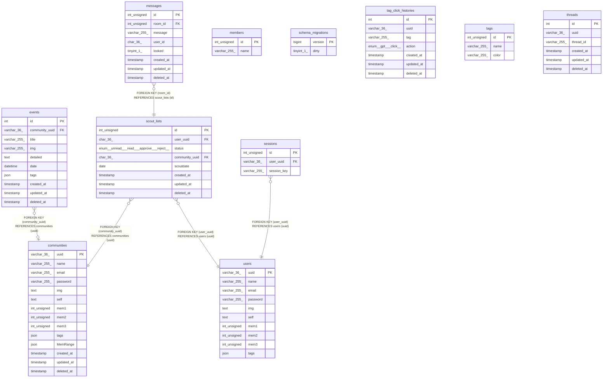

# db

## Tables

| Name | Columns | Comment | Type |
| ---- | ------- | ------- | ---- |
| [communities](communities.md) | 14 |  | BASE TABLE |
| [events](events.md) | 10 |  | BASE TABLE |
| [members](members.md) | 2 |  | BASE TABLE |
| [messages](messages.md) | 8 |  | BASE TABLE |
| [schema_migrations](schema_migrations.md) | 2 |  | BASE TABLE |
| [scout_lists](scout_lists.md) | 8 |  | BASE TABLE |
| [sessions](sessions.md) | 3 |  | BASE TABLE |
| [tag_click_histories](tag_click_histories.md) | 7 |  | BASE TABLE |
| [tags](tags.md) | 3 |  | BASE TABLE |
| [threads](threads.md) | 6 |  | BASE TABLE |
| [users](users.md) | 10 |  | BASE TABLE |

## Relations

---

> Generated by [tbls](https://github.com/k1LoW/tbls)
