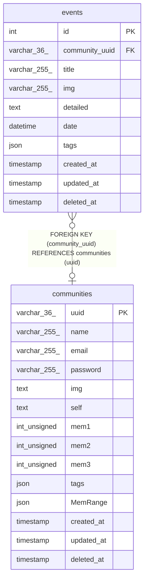

# events

## Description

<details>
<summary><strong>Table Definition</strong></summary>

```sql
CREATE TABLE `events` (
  `id` int NOT NULL AUTO_INCREMENT,
  `community_uuid` varchar(36) DEFAULT NULL,
  `title` varchar(255) NOT NULL,
  `img` varchar(255) NOT NULL,
  `detailed` text NOT NULL,
  `date` datetime NOT NULL,
  `tags` json NOT NULL,
  `created_at` timestamp NULL DEFAULT CURRENT_TIMESTAMP,
  `updated_at` timestamp NULL DEFAULT CURRENT_TIMESTAMP ON UPDATE CURRENT_TIMESTAMP,
  `deleted_at` timestamp NULL DEFAULT NULL,
  PRIMARY KEY (`id`),
  KEY `community_uuid` (`community_uuid`),
  CONSTRAINT `events_ibfk_1` FOREIGN KEY (`community_uuid`) REFERENCES `communities` (`uuid`)
) ENGINE=InnoDB DEFAULT CHARSET=utf8mb4 COLLATE=utf8mb4_0900_ai_ci
```

</details>

## Columns

| Name | Type | Default | Nullable | Extra Definition | Children | Parents | Comment |
| ---- | ---- | ------- | -------- | ---------------- | -------- | ------- | ------- |
| id | int |  | false | auto_increment |  |  |  |
| community_uuid | varchar(36) |  | true |  |  | [communities](communities.md) |  |
| title | varchar(255) |  | false |  |  |  |  |
| img | varchar(255) |  | false |  |  |  |  |
| detailed | text |  | false |  |  |  |  |
| date | datetime |  | false |  |  |  |  |
| tags | json |  | false |  |  |  |  |
| created_at | timestamp | CURRENT_TIMESTAMP | true | DEFAULT_GENERATED |  |  |  |
| updated_at | timestamp | CURRENT_TIMESTAMP | true | DEFAULT_GENERATED on update CURRENT_TIMESTAMP |  |  |  |
| deleted_at | timestamp |  | true |  |  |  |  |

## Constraints

| Name | Type | Definition |
| ---- | ---- | ---------- |
| events_ibfk_1 | FOREIGN KEY | FOREIGN KEY (community_uuid) REFERENCES communities (uuid) |
| PRIMARY | PRIMARY KEY | PRIMARY KEY (id) |

## Indexes

| Name | Definition |
| ---- | ---------- |
| community_uuid | KEY community_uuid (community_uuid) USING BTREE |
| PRIMARY | PRIMARY KEY (id) USING BTREE |

## Relations



---

> Generated by [tbls](https://github.com/k1LoW/tbls)
