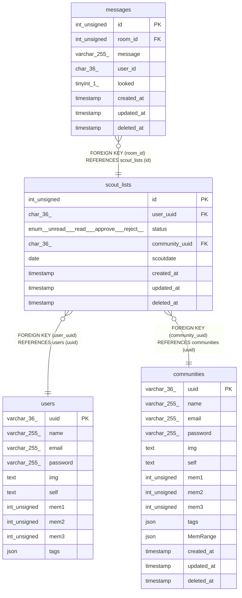

# scout_lists

## Description

<details>
<summary><strong>Table Definition</strong></summary>

```sql
CREATE TABLE `scout_lists` (
  `id` int unsigned NOT NULL AUTO_INCREMENT,
  `user_uuid` char(36) NOT NULL,
  `status` enum('unread','read','approve','reject') NOT NULL DEFAULT 'unread',
  `community_uuid` char(36) NOT NULL,
  `scoutdate` date NOT NULL,
  `created_at` timestamp NOT NULL DEFAULT CURRENT_TIMESTAMP,
  `updated_at` timestamp NOT NULL DEFAULT CURRENT_TIMESTAMP ON UPDATE CURRENT_TIMESTAMP,
  `deleted_at` timestamp NULL DEFAULT NULL,
  PRIMARY KEY (`id`),
  KEY `user_uuid` (`user_uuid`),
  KEY `community_uuid` (`community_uuid`),
  CONSTRAINT `scout_lists_ibfk_1` FOREIGN KEY (`user_uuid`) REFERENCES `users` (`uuid`),
  CONSTRAINT `scout_lists_ibfk_2` FOREIGN KEY (`community_uuid`) REFERENCES `communities` (`uuid`)
) ENGINE=InnoDB DEFAULT CHARSET=utf8mb4 COLLATE=utf8mb4_0900_ai_ci
```

</details>

## Columns

| Name | Type | Default | Nullable | Extra Definition | Children | Parents | Comment |
| ---- | ---- | ------- | -------- | ---------------- | -------- | ------- | ------- |
| id | int unsigned |  | false | auto_increment | [messages](messages.md) |  |  |
| user_uuid | char(36) |  | false |  |  | [users](users.md) |  |
| status | enum('unread','read','approve','reject') | unread | false |  |  |  |  |
| community_uuid | char(36) |  | false |  |  | [communities](communities.md) |  |
| scoutdate | date |  | false |  |  |  |  |
| created_at | timestamp | CURRENT_TIMESTAMP | false | DEFAULT_GENERATED |  |  |  |
| updated_at | timestamp | CURRENT_TIMESTAMP | false | DEFAULT_GENERATED on update CURRENT_TIMESTAMP |  |  |  |
| deleted_at | timestamp |  | true |  |  |  |  |

## Constraints

| Name | Type | Definition |
| ---- | ---- | ---------- |
| PRIMARY | PRIMARY KEY | PRIMARY KEY (id) |
| scout_lists_ibfk_1 | FOREIGN KEY | FOREIGN KEY (user_uuid) REFERENCES users (uuid) |
| scout_lists_ibfk_2 | FOREIGN KEY | FOREIGN KEY (community_uuid) REFERENCES communities (uuid) |

## Indexes

| Name | Definition |
| ---- | ---------- |
| community_uuid | KEY community_uuid (community_uuid) USING BTREE |
| user_uuid | KEY user_uuid (user_uuid) USING BTREE |
| PRIMARY | PRIMARY KEY (id) USING BTREE |

## Relations



---

> Generated by [tbls](https://github.com/k1LoW/tbls)
