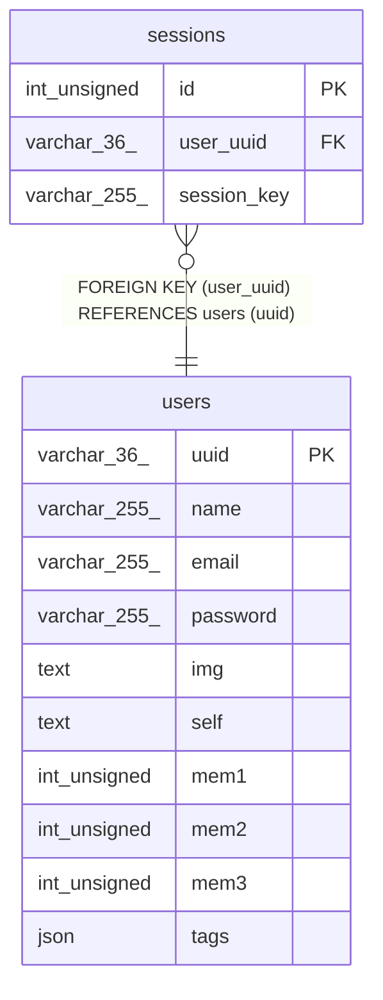

# sessions

## Description

<details>
<summary><strong>Table Definition</strong></summary>

```sql
CREATE TABLE `sessions` (
  `id` int unsigned NOT NULL AUTO_INCREMENT,
  `user_uuid` varchar(36) NOT NULL,
  `session_key` varchar(255) NOT NULL,
  PRIMARY KEY (`id`),
  KEY `user_uuid` (`user_uuid`),
  CONSTRAINT `sessions_ibfk_1` FOREIGN KEY (`user_uuid`) REFERENCES `users` (`uuid`)
) ENGINE=InnoDB DEFAULT CHARSET=utf8mb4 COLLATE=utf8mb4_0900_ai_ci
```

</details>

## Columns

| Name | Type | Default | Nullable | Extra Definition | Children | Parents | Comment |
| ---- | ---- | ------- | -------- | ---------------- | -------- | ------- | ------- |
| id | int unsigned |  | false | auto_increment |  |  |  |
| user_uuid | varchar(36) |  | false |  |  | [users](users.md) |  |
| session_key | varchar(255) |  | false |  |  |  |  |

## Constraints

| Name | Type | Definition |
| ---- | ---- | ---------- |
| PRIMARY | PRIMARY KEY | PRIMARY KEY (id) |
| sessions_ibfk_1 | FOREIGN KEY | FOREIGN KEY (user_uuid) REFERENCES users (uuid) |

## Indexes

| Name | Definition |
| ---- | ---------- |
| user_uuid | KEY user_uuid (user_uuid) USING BTREE |
| PRIMARY | PRIMARY KEY (id) USING BTREE |

## Relations



---

> Generated by [tbls](https://github.com/k1LoW/tbls)
