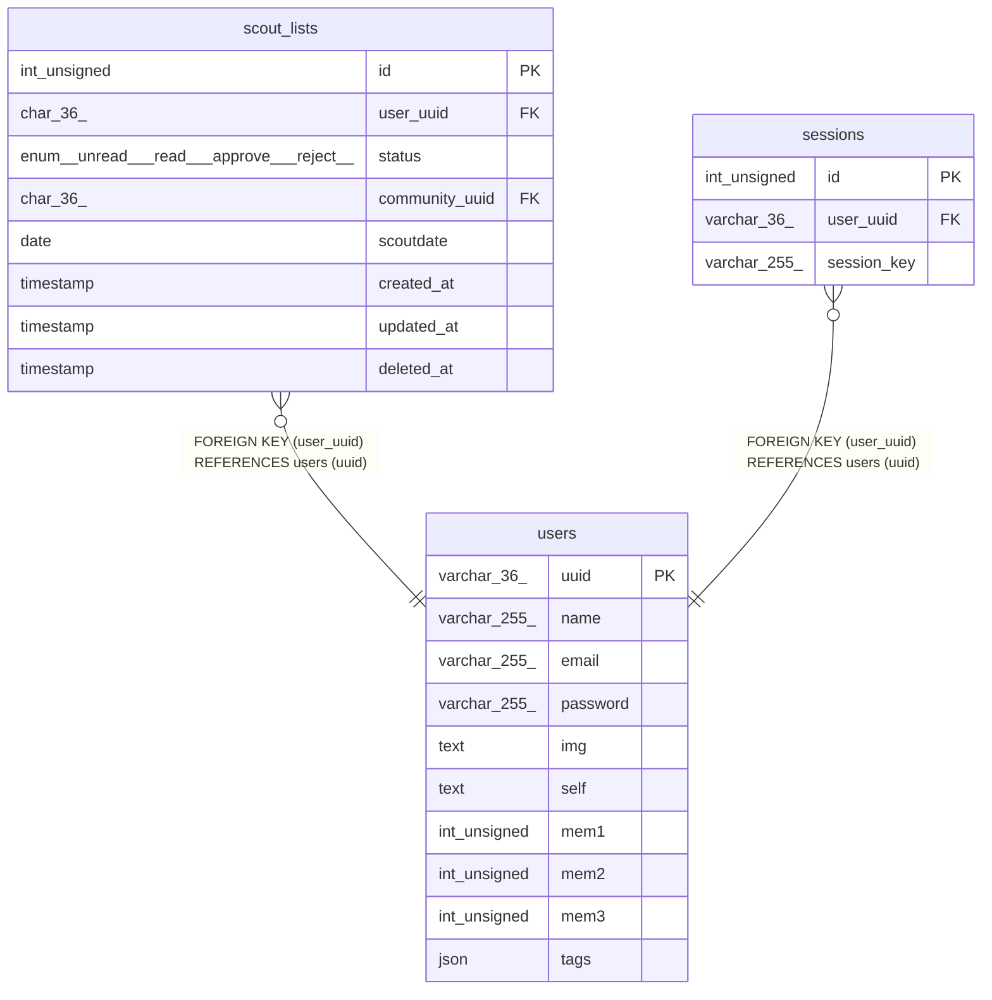

# users

## Description

<details>
<summary><strong>Table Definition</strong></summary>

```sql
CREATE TABLE `users` (
  `uuid` varchar(36) NOT NULL,
  `name` varchar(255) NOT NULL,
  `email` varchar(255) NOT NULL,
  `password` varchar(255) NOT NULL,
  `img` text,
  `self` text,
  `mem1` int unsigned DEFAULT NULL,
  `mem2` int unsigned DEFAULT NULL,
  `mem3` int unsigned DEFAULT NULL,
  `tags` json DEFAULT NULL,
  PRIMARY KEY (`uuid`),
  UNIQUE KEY `email` (`email`)
) ENGINE=InnoDB DEFAULT CHARSET=utf8mb4 COLLATE=utf8mb4_0900_ai_ci
```

</details>

## Columns

| Name | Type | Default | Nullable | Children | Parents | Comment |
| ---- | ---- | ------- | -------- | -------- | ------- | ------- |
| uuid | varchar(36) |  | false | [scout_lists](scout_lists.md) [sessions](sessions.md) |  |  |
| name | varchar(255) |  | false |  |  |  |
| email | varchar(255) |  | false |  |  |  |
| password | varchar(255) |  | false |  |  |  |
| img | text |  | true |  |  |  |
| self | text |  | true |  |  |  |
| mem1 | int unsigned |  | true |  |  |  |
| mem2 | int unsigned |  | true |  |  |  |
| mem3 | int unsigned |  | true |  |  |  |
| tags | json |  | true |  |  |  |

## Constraints

| Name | Type | Definition |
| ---- | ---- | ---------- |
| email | UNIQUE | UNIQUE KEY email (email) |
| PRIMARY | PRIMARY KEY | PRIMARY KEY (uuid) |

## Indexes

| Name | Definition |
| ---- | ---------- |
| PRIMARY | PRIMARY KEY (uuid) USING BTREE |
| email | UNIQUE KEY email (email) USING BTREE |

## Relations



---

> Generated by [tbls](https://github.com/k1LoW/tbls)
